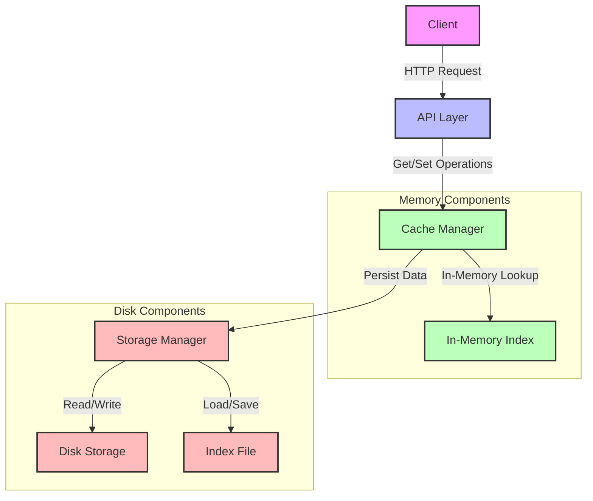

# Fastbu

<p align="center">
  
</p>

A fast, resilient, fault-tolerant, and on-disk caching system written in Rust.

## Overview

Fastbu is a lightweight caching system that provides persistent storage with high performance and reliability. It's designed to be simple to use while offering robust features for data persistence and retrieval.

I did this project just to learn Rust and it and probably it's not production ready.

## Features

- **Fast Access**: In-memory index for quick lookups combined with efficient disk storage
- **Binary Serialization**: Uses bincode for compact and fast serialization
- **Fault Tolerance**: Metadata tracking and cleanup capabilities
- **Thread Safety**: Mutex-protected operations for concurrent access
- **REST API**: Simple HTTP interface for cache operations
- **Configurable**: Customizable host and port settings

## Installation

### Prerequisites

- Rust 1.56.0 or later
- Cargo (comes with Rust)
- Make (for using the Makefile)

### Building from Source

```bash
# Clone the repository
git clone https://github.com/adelra/fastbu.git
cd fastbu

# Build the project
cargo build --release

# Or using Make
make build-release
```

### Docker

```bash
# Pull the Docker image
docker pull adelra/fastbu

# Run the container
docker run -p 3031:3031 adelra/fastbu

# Or build and run locally
make docker-build
make docker-run
```

## Usage

### Starting the Server

```bash
# Run with default settings (localhost:3030)
cargo run

# Or using Make
make run

# Run on a specific port
cargo run -- -p 8080

# Run on a specific host and port
cargo run -- -h 0.0.0.0 -p 8080
```

### Command Line Options

- `-h, --host <HOST>` - Specify the host to bind to (default: 127.0.0.1)
- `-p, --port <PORT>` - Specify the port to listen on (default: 3030)

### API Endpoints

The server exposes the following REST API endpoints:

- `GET /get/{key}` - Retrieve a value from the cache
- `POST /set/{key}/{value}` - Store a key-value pair in the cache

### Example Usage

```bash
# Store a value
curl -X POST "http://localhost:3030/set/mykey/myvalue"

# Retrieve a value
curl "http://localhost:3030/get/mykey"
```

## Development

### Makefile Commands

The project includes a Makefile to simplify common development tasks:

```bash
# Show available commands
make help

# Format code
make format

# Check formatting
make format-check

# Run linter
make lint

# Run all checks (format and lint)
make check

# Build the project
make build

# Build in release mode
make build-release

# Run tests
make test

# Generate code coverage
make coverage

# Clean build artifacts
make clean

# Install development dependencies
make install-dev-deps
```

## Architecture

Fastbu uses a hybrid approach combining in-memory indexing with disk-based storage:

1. **In-Memory Index**: Maintains a fast lookup table for all cache entries
2. **Disk Storage**: Persists data in binary format for efficiency
3. **Metadata Tracking**: Records creation time, update time, and size for each entry
4. **Cleanup Mechanism**: Detects and reports inconsistencies in the storage



## Storage Structure

- All cache files are stored in the `cache_storage` directory
- An index file (`cache_index.bin`) tracks all cache entries
- Each cache entry is stored in a separate file with metadata

## Performance Considerations

- Binary serialization for compact storage and fast processing
- Index-based lookups for efficient retrieval
- Thread-safe operations for concurrent access
- Configurable file size limits

## CI/CD

This project uses GitHub Actions for continuous integration and deployment:

- **Rust CI**: Builds, tests, and lints the code
- **Docker CI/CD**: Builds and publishes Docker images
- **Code Coverage**: Generates and uploads code coverage reports

### Status Badges

[](https://github.com/adelra/fastbu/actions/workflows/rust.yml)
[](https://github.com/adelra/fastbu/actions/workflows/docker.yml)
[](https://github.com/adelra/fastbu/actions/workflows/coverage.yml)

## Contributing

Contributions are welcome! Please feel free to submit a Pull Request.